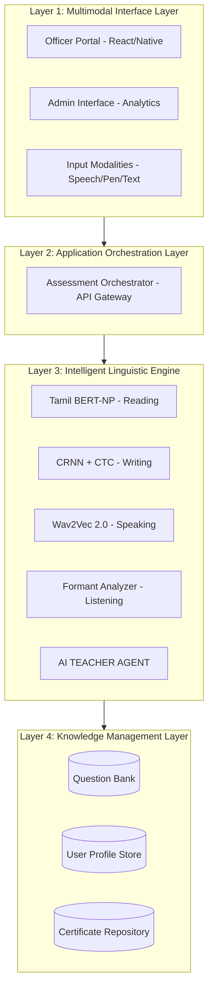

# Unified Tamil Language Proficiency (UTLAP) Platform

[](https://en.wikipedia.org/wiki/Tamil_language)
[](#)
[](#)

A comprehensive, multimodal assessment platform designed to evaluate proficiency in the Tamil language across four core dimensions: **Listening, Speaking, Reading, and Writing**. This platform utilizes state-of-the-art AI models to provide real-time feedback and semantic scoring.

## 🌟 Overview

The UTLAP Platform is a unified solution for Tamil language evaluation, featuring:
- **Multimodal Interface**: Support for speech input, digital pen handwriting, and text.
- **Intelligent Linguistic Engine**: Powered by specialized AI models for phonetics, syntax, and semantics.
- **Hierarchical Assessment**: Three levels of evaluation (Basic, Intermediate, Advanced).
- **Automated Feedback**: Real-time results and "AI Teacher" feedback.

---

## 🏗️ System Architecture

The project follows a 4-layer IEEE-standard architecture:



---

## 🛠️ Tech Stack

| Component | Sub-system / Algorithm |
| :--- | :--- |
| **Frontend** | React, TailwindCSS, HTML5 Canvas |
| **Logic Controller** | Node.js, Python (FastAPI, Flask) |
| **NLP Core** | Tamil BERT-Base (Semantic analysis, Grammar) |
| **Audio Engine** | Wav2Vec 2.0 (Phoneme mapping, Pronunciation) |
| **OCR Module** | Attention-based LSTM / ResNet (Handwriting recognition) |
| **Storage** | MongoDB, PostgreSQL |

---

## 📂 Project Structure

- `/frontend`: Main application UI and module integration logic.
- `/reading skill final one`: Reading assessment module (Flask-based).
- `/tamil writing skill`: Writing assessment module (OCR/Handwriting).
- `/speaking tamil`: Speaking assessment module (Audio analysis).
- `/speaking hindi`: (Parallel Hindi assessment module).
- `/tamil-listening-module`: Listening assessment module (Phonetics).

---

## 🚀 Getting Started

### Prerequisites
- Python 3.8+
- Node.js & npm
- Git

### Installation

1. **Clone the repository**:
   ```bash
   git clone https://github.com/Saravanan2005real/Tamil-Prouficiency-Assesment-Platform-IITM.git
   cd Tamil-Prouficiency-Assesment-Platform-IITM
   ```

2. **Configure Modules**:
   The platform uses a centralized configuration in `/frontend/modules-config.js`. Update the `baseUrl` or individual module URLs as needed.

3. **Run Modules**:
   Each module can be started independently:
   - **Reading Module**: `cd "reading skill final one" && bash run.sh`
   - **Writing Module**: `cd "tamil writing skill" && python app.py`
   - **Speaking Module**: `cd "speaking tamil" && ./START_BACKEND.bat`

---

## 📝 Configuration

All module URLs and settings are centralized in `frontend/modules-config.js`. You can easily switch between local and production servers by modifying the `baseUrl`.

```javascript
// Example Configuration
const modulesConfig = {
    baseUrl: 'http://localhost:5000',
    modules: {
        listening: { enabled: true, ... },
        speaking: { enabled: true, ... },
        // ...
    }
};
```

---

## 🤝 Contributing

Contributions are welcome! Please follow these steps:
1. Fork the project.
2. Create your Feature Branch (`git checkout -b feature/AmazingFeature`).
3. Commit your changes (`git commit -m 'Add some AmazingFeature'`).
4. Push to the branch (`git push origin feature/AmazingFeature`).
5. Open a Pull Request.

---

## 📄 License

Distributed under the MIT License. See `LICENSE` for more information.

---

**Developed for IIT Madras - Tamil Proficiency Assessment Initiative**