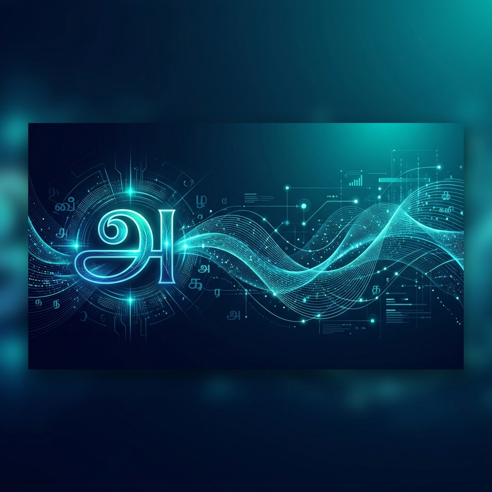
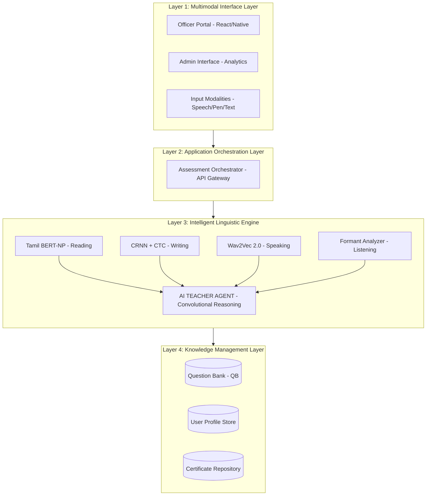
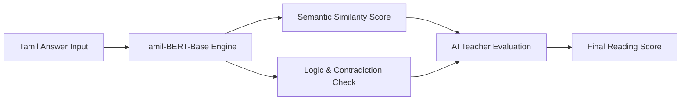
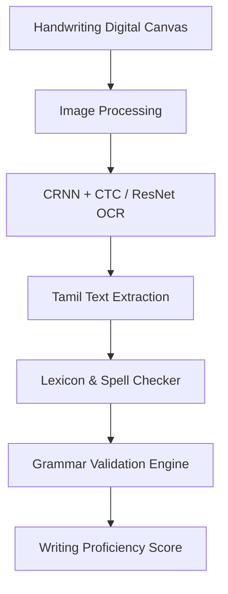
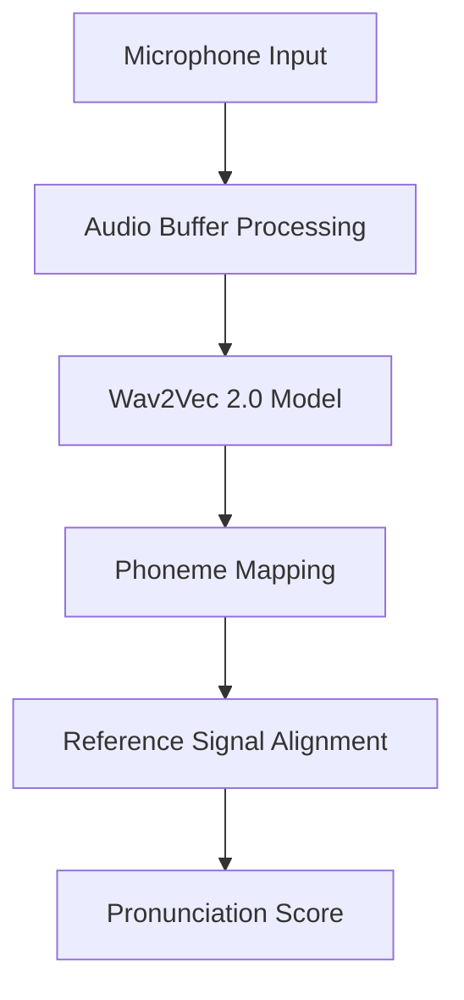
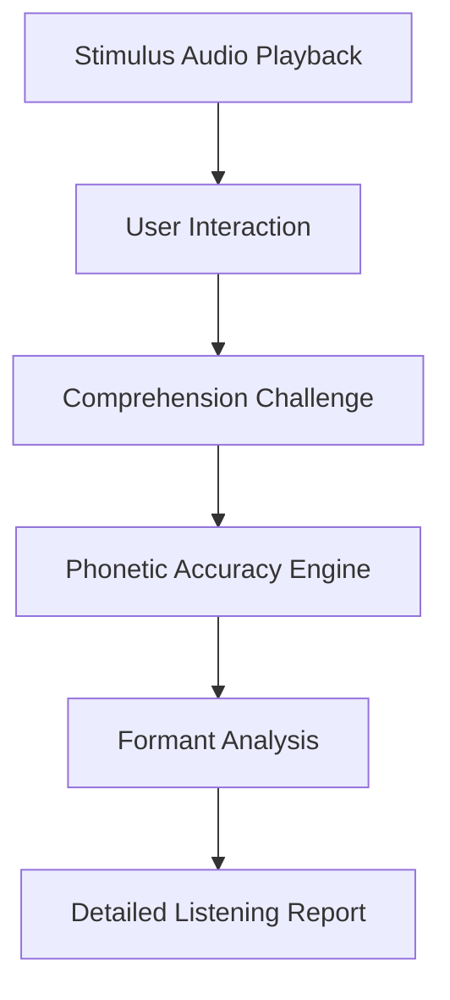
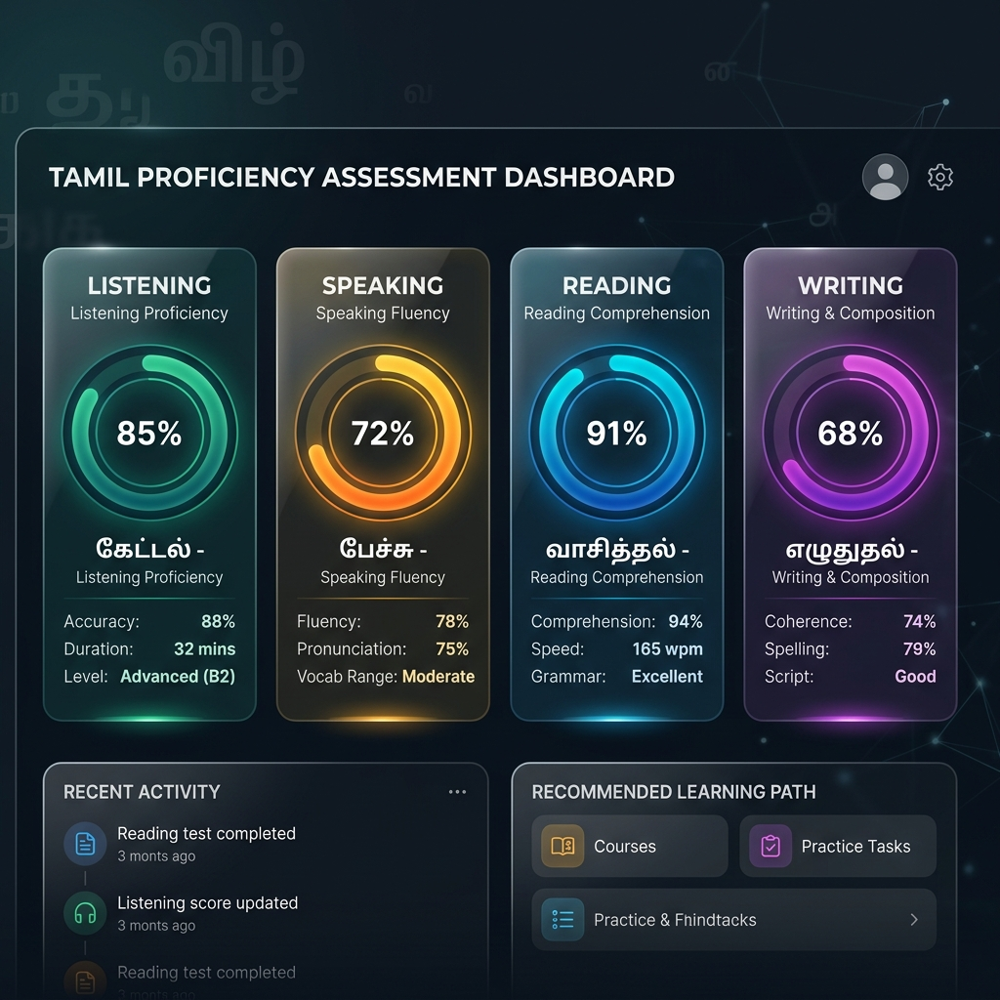

# 🏆 Unified Tamil Language Proficiency (UTLAP) Platform



[](https://en.wikipedia.org/wiki/Tamil_language)
[](#)
[](#)

A state-of-the-art, multimodal assessment platform designed for **IIT Madras** to evaluate proficiency in the Tamil language. The platform integrates deep learning models for speech, handwriting, and semantic text analysis to provide a comprehensive 4-dimensional evaluation.

---

## 🏗️ Overall System Architecture

The UTLAP platform follows a 4-layer IEEE-standard architecture, ensuring scalability, modularity, and high-performance AI orchestration.



---

## 🧩 Core Modules & Architecture

### 1. 📖 Reading Skill Module
Evaluates comprehension through semantic similarity and syntactic accuracy using transformer-based models.

**Architecture:**


### 2. ✍️ Writing Skill Module
Uses advanced OCR and Linguistic validation to score handwritten Tamil input.

**Architecture:**


### 3. 🗣️ Speaking Skill Module
Leverages fine-tuned acoustic models to assess pronunciation, fluency, and phoneme accuracy.

**Architecture:**


### 4. 👂 Listening Skill Module
Focuses on phonetic comprehension and audio-visual correlation.

**Architecture:**


---

## 🖥️ Visual Preview


*Figure 1: Unified Assessment Dashboard Mockup*

---

## 🛠️ Technological Stack

| Layer | Technology | Purpose |
| :--- | :--- | :--- |
| **Frontend** | React, HTML5 Canvas, TailwindCSS | User interface and multimodal capture. |
| **API Layer** | FastAPI, Node.js | Service orchestration and scoring consolidation. |
| **NLP Engine** | Tamil BERT, Ollama (Llama 3) | Semantic analysis and grammar detection. |
| **Vision Engine** | PyTorch, CRNN, CTC Loss | Handwritten Tamil script recognition (OCR). |
| **Audio Engine** | Wav2Vec 2.0, Librosa | Phoneme mapping and audio feature extraction. |
| **Storage** | MongoDB, PostgreSQL | Persistence of profiles and certifications. |

---

## 🚀 Getting Started

### Prerequisites
- Python 3.9+
- Node.js 16+
- CUDA-enabled GPU (Highly recommended for OCR and BERT modules)

### Installation

1. **Clone the repository**:
   ```bash
   git clone https://github.com/Saravanan2005real/Tamil-Prouficiency-Assesment-Platform-IITM.git
   cd Tamil-Prouficiency-Assesment-Platform-IITM
   ```

2. **Initialize Submodules**:
   Each module can be run independently using the provided batch/shell scripts:
   - **Reading Module**: `reading skill final one/run.sh`
   - **Writing Module**: `tamil writing skill/app.py`
   - **Speaking Module**: `speaking tamil/START_BACKEND.bat`

---

## 📜 Documentation
Detailed technical specifications for each layer are available in the `/docs` directory and within each module's respective README.

---

**Developed for IIT Madras - Tamil Proficiency Assessment Initiative**