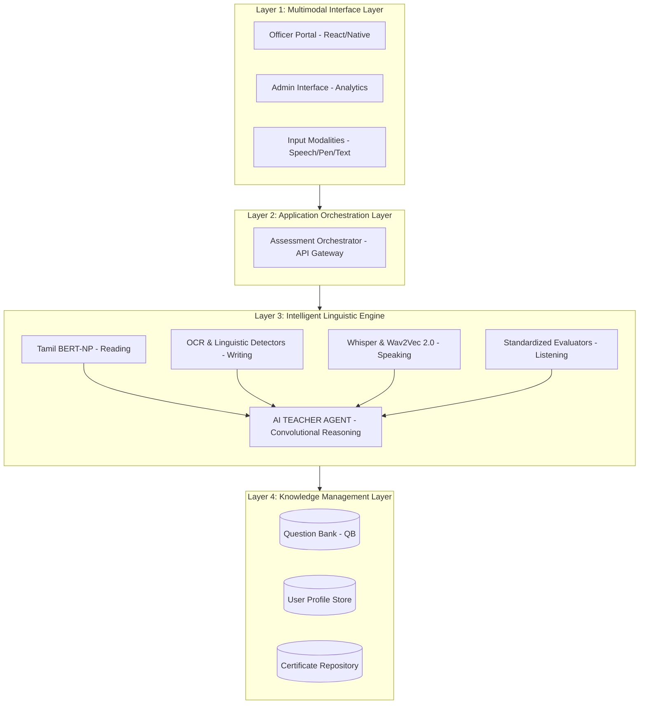
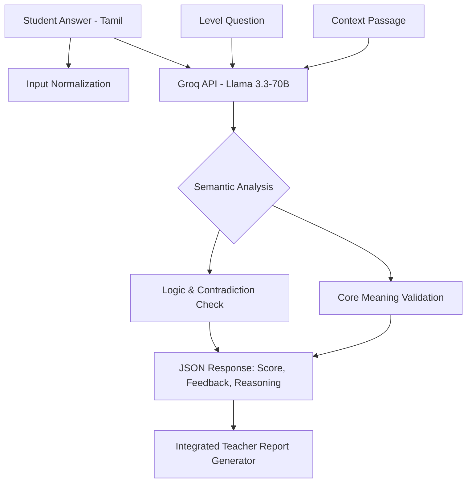
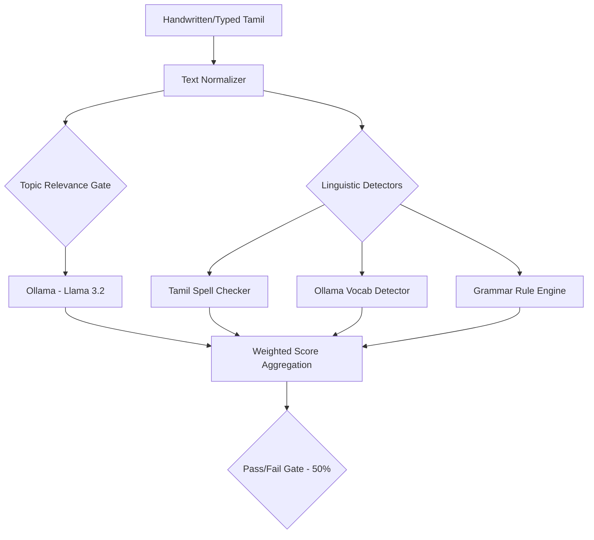
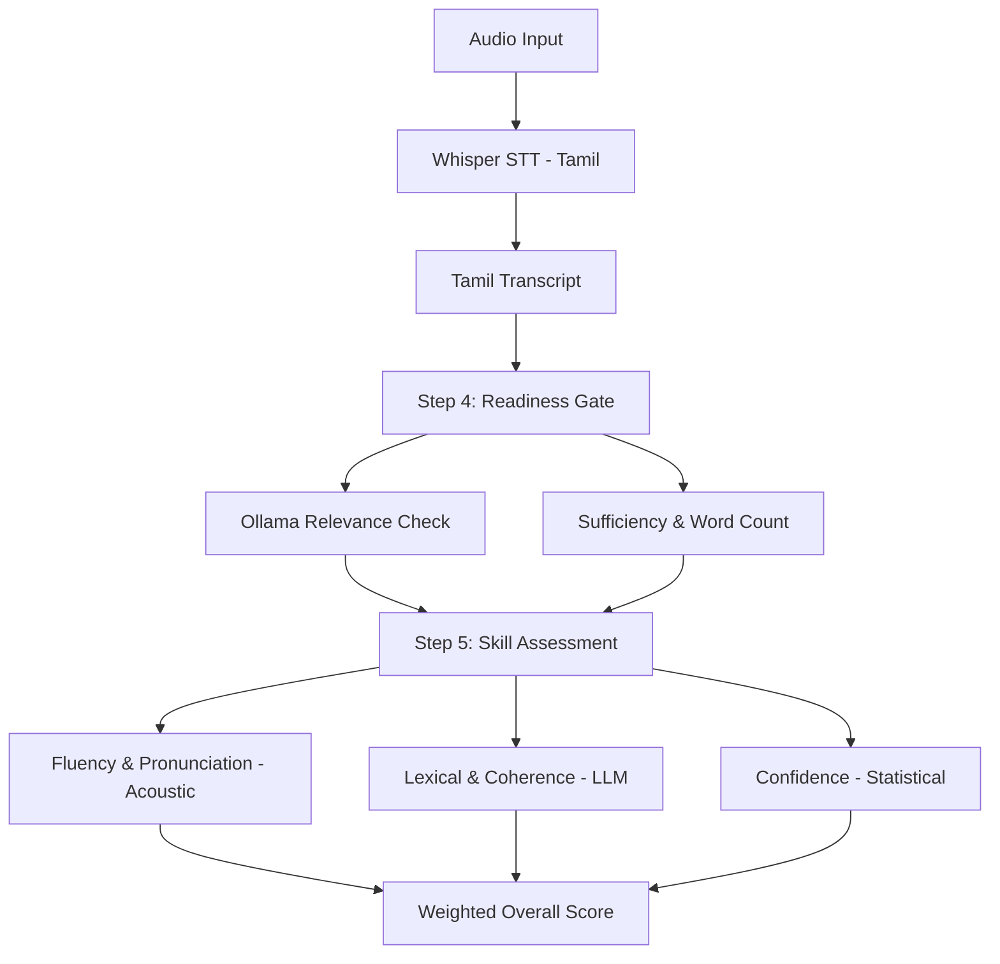
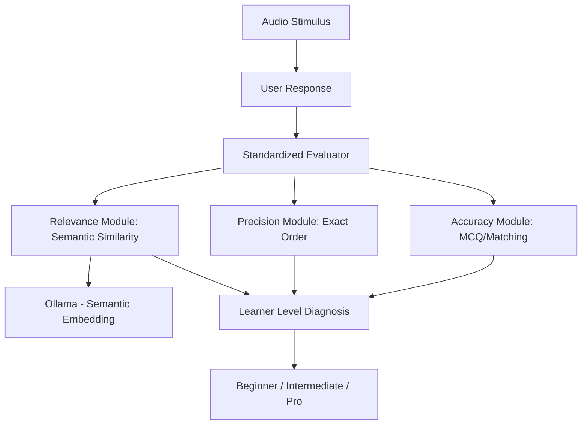

# 🏆 Unified Tamil Language Proficiency (UTLAP) Platform


[](https://en.wikipedia.org/wiki/Tamil_language)
[](#)
[](#)

A state-of-the-art, multimodal assessment platform designed for **IIT Madras** to evaluate proficiency in the Tamil language. The platform integrates deep learning models for speech, handwriting, and semantic text analysis to provide a comprehensive 4-dimensional evaluation.

---

## 🏗️ Overall System Architecture

The UTLAP platform follows a 4-layer IEEE-standard architecture, ensuring scalability, modularity, and high-performance AI orchestration.



---

## 🧩 Module-Specific Architectures

### 1. 📖 Reading Skill Module (LLM-Optimized)
Evaluates comprehension through deep semantic analysis using ultra-high-parameter models.

**Architecture:**


### 2. ✍️ Writing Skill Module (Hybrid Evaluation)
Uses a combination of local linguistic rules and LLM content analysis to score handwritten or typed Tamil.

**Architecture:**


### 3. 🗣️ Speaking Skill Module (Two-Step Assessment)
Leverages a robust multi-stage pipeline to evaluate both the validity of the response and the quality of speech.

**Architecture:**


### 4. 👂 Listening Skill Module (Multi-Metric Diagnostic)
Focuses on standardized correctness across multiple linguistic dimensions.

**Architecture:**


---

## 🖥️ Visual Preview


*Figure 1: Unified Assessment Dashboard Mockup*

---

## 🛠️ Technological Stack

| Layer | Technology | Purpose |
| :--- | :--- | :--- |
| **Frontend** | React, HTML5 Canvas, TailwindCSS | User interface and multimodal capture. |
| **STT Engine** | OpenAI Whisper (Tamil) | High-accuracy speech-to-text conversion. |
| **NLP Engine** | Llama 3.3 (Groq), Llama 3.2 (Ollama) | Semantic analysis and topic relevance. |
| **Linguistic Logic** | Custom Python Rule Engines | Grammar, Spelling, and Vocabulary detection. |
| **Audio Analysis** | Librosa, NumPy, Whisper Logprobs | Fluency and Pronunciation metrics. |
| **Storage** | MongoDB, PostgreSQL | Persistence of profiles and certifications. |

---

## 🚀 Getting Started

### Prerequisites
- Python 3.9+
- Node.js 16+
- Ollama (running locally with `llama3.2` and `qwen2.5:3b`)
- Groq API Key (for Reading Module)

### Installation

1. **Clone the repository**:
   ```bash
   git clone https://github.com/Saravanan2005real/Tamil-Prouficiency-Assesment-Platform-IITM.git
   ```

2. **Module Execution**:
   Each module can be run independently:
   - **Reading Module**: `reading skill final one/run.sh` (Port 5003)
   - **Writing Module**: `tamil writing skill/app.py` (Port 5000)
   - **Speaking Module**: `speaking tamil/START_BACKEND.bat` (Port 5002)
   - **Listening Module**: `tamil-listening-module/START_BACKEND.bat` (Port 5001)

---

**Developed for IIT Madras - Tamil Proficiency Assessment Initiative**