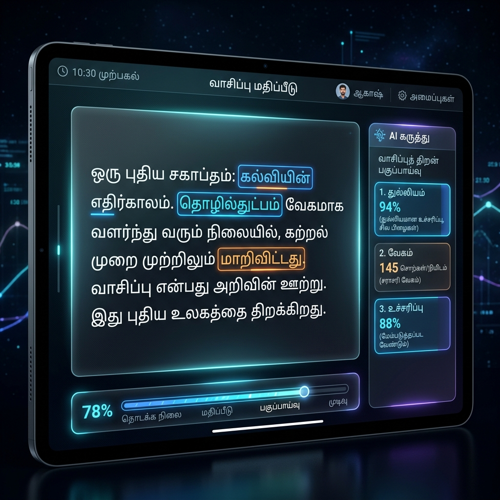
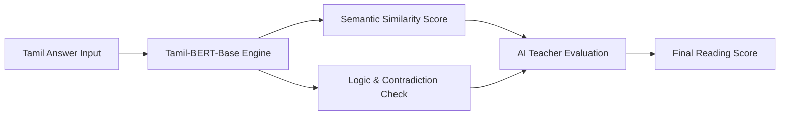

# 📖 Tamil Reading Assessment Module



A comprehensive Tamil reading comprehension assessment engine powered by Transformer models.

## 🏗️ Module Architecture



## Features

- **Paragraph Display**: Shows the reading passage first
- **Question Interface**: Interactive question cards with Tamil input support
- **Dual Input Methods**:
  - Google Input Tools (English to Tamil transliteration)
  - Tamil Virtual Keyboard with essential letters
- **Hover Functionality**: Hover over Tamil letters to see all variations (e.g., க → க, கா, கி, கீ, etc.)
- **Comprehensive Evaluation**: Each question is evaluated using 5 modules:
  1. Semantic Similarity
  2. Concept Validation
  3. Logic Validation
  4. Core Alignment
  5. Contradiction Detection
- **Detailed Results**: Shows all 5 scores with visual progress bars, marks, and pass/fail status

## Installation

1. Install Python dependencies:
```bash
pip install -r requirements.txt
```

2. Run the Flask server:
```bash
python app.py
```

3. Open your browser and navigate to:
```
http://localhost:5000
```

## Usage

1. Read the paragraph displayed on the first page
2. Click "Go to Questions" to proceed
3. For each question:
   - Type your answer in Tamil
   - Use either Google Input Tools (type in English, get Tamil) or the Tamil Keyboard
   - Click "Evaluate" to see detailed results
4. Review all 5 evaluation scores and your marks

## Project Structure

- `app.py` - Flask backend API
- `static/index.html` - Main HTML page
- `static/style.css` - Styling
- `static/app.js` - Main application logic
- `static/tamil-keyboard.js` - Tamil keyboard component
- `tamil_*.py` - Evaluation modules

## Evaluation Modules

The system uses 5 evaluation modules:
1. **Normalization** - Cleans and normalizes Tamil text
2. **Semantic Similarity** - Uses multilingual embeddings to compare meaning
3. **Concept & Logic Validation** - Rule-based validation of concepts and logic
4. **Core Alignment** - Checks event-level alignment
5. **Contradiction Detection** - Detects contradictory answers

Final score is computed using weighted combination: 40% semantic + 30% logic + 20% alignment, multiplied by contradiction score.

