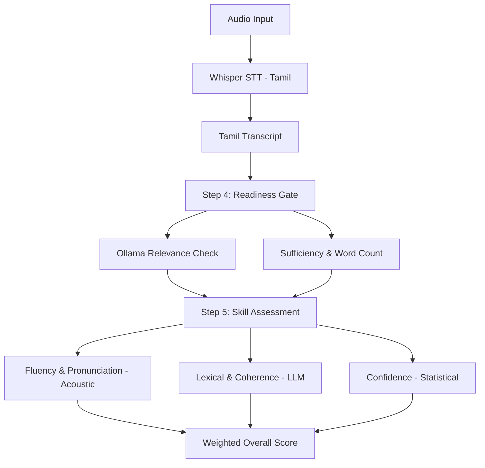

# 🗣️ Tamil Speaking Assessment Module

## 🏗️ Module Architecture

## Overview
This module evaluates Tamil pronunciation and fluency using a fine-tuned Wav2Vec 2.0 model. It provides real-time feedback through an AI Teacher Agent.

## Features
- **Wav2Vec 2.0 Integration**: High-accuracy phoneme recognition for Tamil.
- **Formant Analysis**: Detailed acoustic analysis for vowel clarity.
- **Interactive Avatar**: Real-time feedback via a visual teacher agent.

## Setup
Refer to [README_SETUP.md](README_SETUP.md) for detailed installation and execution instructions.
