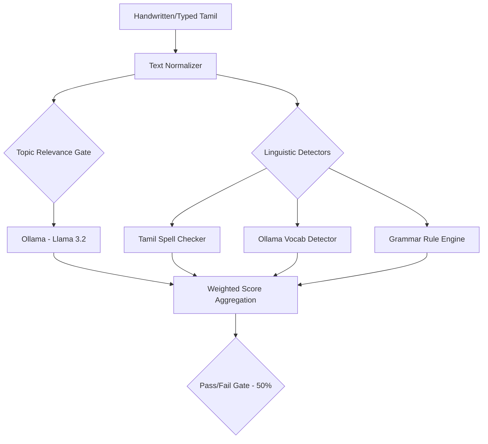

# ✍️ Tamil Writing Assessment Module (OCR & Grammar)

## 🏗️ Module Architecture



A comprehensive web application for evaluating Tamil writing proficiency across three levels. The system checks for spelling, vocabulary usage, grammar correctness, and topic relevance.

## Features

*   **Three Proficiency Levels**:
    *   **Level 1**: Basic self-introduction (Min 20 words).
    *   **Level 2**: Nature conservation (Min 30 words).
    *   **Level 3**: Importance of education (Min 40 words).
*   **Intelligent Evaluation**:
    *   **Spell Checker**: Identifies incorrect spellings and suggests corrections.
    *   **Vocabulary Analysis**: Checks relevance of words to the topic using Ollama (Llama 3.2).
    *   **Grammar Engine**: Rule-based engine for checking subject-verb agreement, tense, and case markers.
    *   **Scoring System**: Quantitative scoring (Out of 100) with detailed deduction breakdown.

## Prerequisites

1.  **Python 3.8+**
2.  **Ollama**: Required for vocabulary and context relevance checking.
    *   Download from [ollama.com](https://ollama.com)
    *   Install and run Ollama.
    *   Pull the required model: `ollama pull llama3.2`

## Installation

1.  Install the required Python packages:
    ```bash
    pip install -r requirements.txt
    ```

## Running the Application

1.  Start the Flask server:
    ```bash
    python app.py
    ```

2.  Open your web browser and navigate to:
    ```
    http://localhost:5000
    ```

## Usage Guide

1.  Select a proficiency level from the home page.
2.  Read the prompt (question) carefully.
3.  Type your answer in Tamil in the text box.
4.  Click **Submit Answer**.
5.  View your **Score** and detailed feedback:
    *   **Score**: Your mark out of 100.
    *   **Deductions**: Breakdown of marks lost for word count, spelling, vocabulary, or grammar errors.
    *   **Errors**: Specific errors highlighted with explanations and corrections.

## Project Structure

*   `app.py`: Main Flask application and evaluation pipeline.
*   `tamil_grammar_detector.py`: Core grammar checking logic.
*   `tamil_grammar_rules.py`: Linguistic rules and definitions.
*   `tamil_vocab_ollama_detector.py`: AI-powered vocabulary validator.
*   `tamil_spell_checker.py`: Spell checking module.
*   `cleaned_tamil_lexicon.txt`: Dictionary dataset.
*   `templates/`: HTML files for the web interface.
